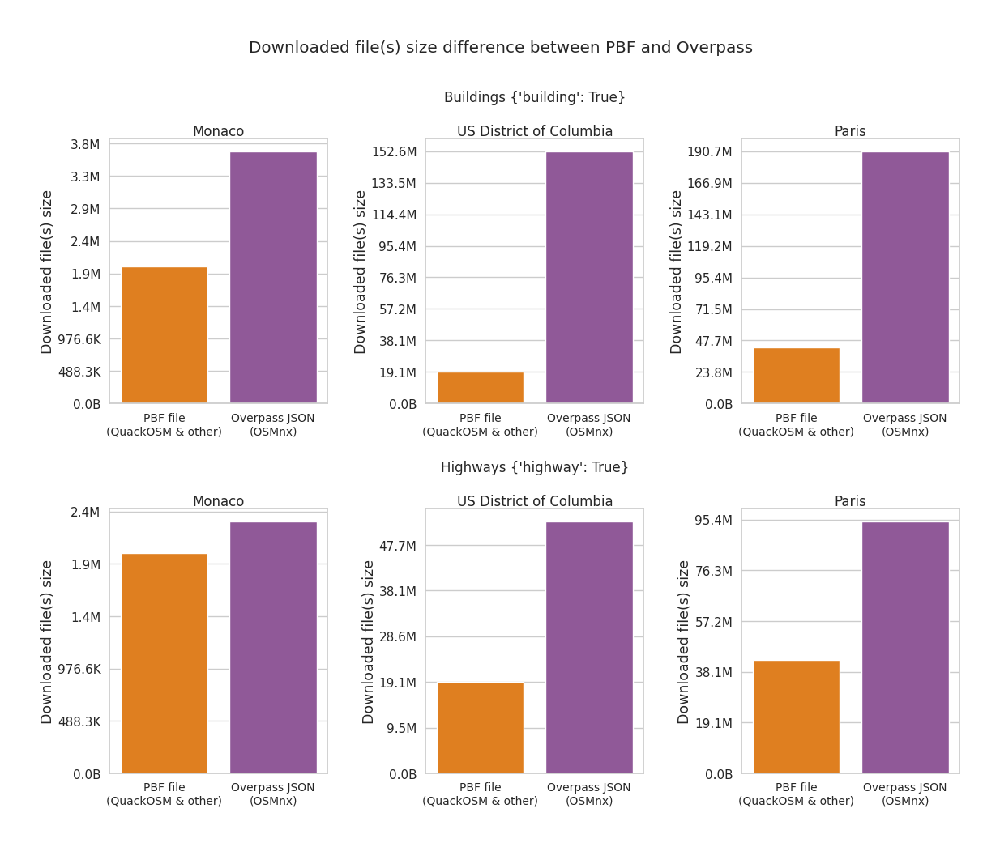
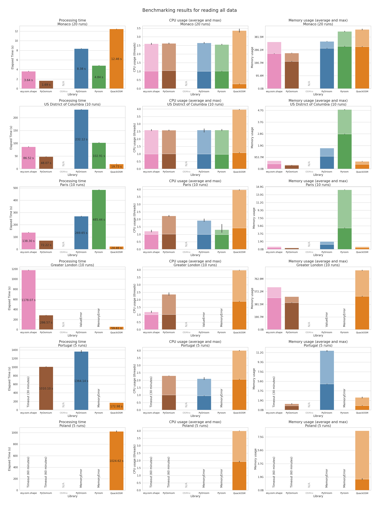
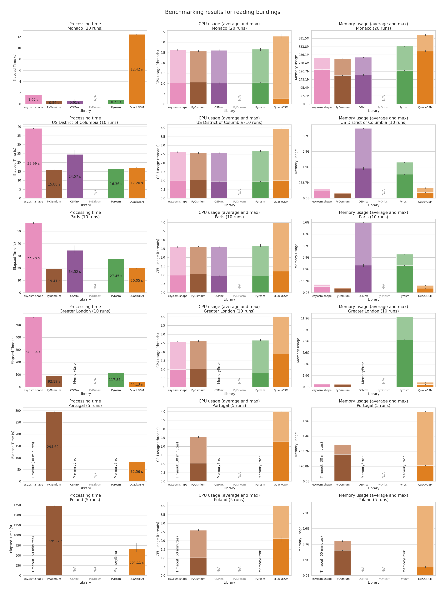
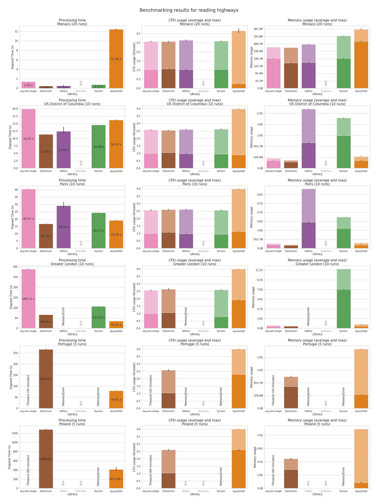

# OpenStreetMap Python readers benchmark

Last update: `2025-06-20`

A benchmark for comparing performance of multiple Python libraries for downloading data from OpenStreetMap.

List of tested libraries (alphabetical order):

- [esy.osm.shape](https://gitlab.com/dlr-ve-esy/esy-osm-shape) (3 ⭐ on GitLab) - Library for reading existing PBF files and transforming them into `Shapely` geometries. Uses `protobuf` reader via `esy.osm.pbf` library. Can stream features and allow user to implement filtering logic.
- [OSMnx](https://github.com/gboeing/osmnx) (5181 ⭐) - Most popular Python library for accessing OpenStreetMap data and street-network analyses. Downloads data from Overpass API for any region in the world. Automatically splits big geometries into smaller polygons. Saves data in cache as JSON responses. Can filter features with user-friendly dict-based tags filter, reads all data as `GeoDataFrame` and cannot stream features.
- [PyDriosm](https://github.com/mikeqfu/pydriosm) (48 ⭐) - Wrapper around GDAL that can read data from OpenStreetMap data from PBF and SHP files in layers. Can download files from Geofabrik and BBBike by name. Loads all data into `GeoDataFrame`, cannot stream features for big files and cannot filter data based on tags.
- [PyOsmium](https://github.com/osmcode/pyosmium) (569 ⭐) - Low-level reader written in C++ with bindings in Python. Exposes handlers for different types of objects read from PBF file and enables parsing of geometries to WKB format. Streaming features and filtering is left for user to implement.
- [Pyrosm](https://github.com/pyrosm/pyrosm) (384 ⭐) - Library written in Cython with `pyrobuf` library for fast data reading from PBF files. Can download PBF files from BBBike and Geofabrik with a static Python API for a given query. Requires dict-based tags filters, loads all data into `GeoDataFrame`, cannot stream features for big files.
- [QuackOSM](https://github.com/kraina-ai/quackosm) (276 ⭐) - Library based on `DuckDB` engine with `spatial` extension that can read big PBF files without memory limitations. Can automatically download matching OSM extracts from BBBike, Geofabrik and OpenStreetMap.fr for a given geometry and saves parsed data as GeoParquet. Can filter data with dict-based tag filter with additional features like negative filters and wildcard filters. Don't have to stream features, since it is designed to work with big PBF files.

## Benchmark tasks

Data types:
- Buildings - extract building data from PBF file: `{"building": True}` - excluded PyDriosm, because can't filter features.
- Highways - extract highways data from PBF file: `{"highway": True}` - excluded PyDriosm, because can't filter features.
- All data - extract all data from the PBF file (had to read all existing tags from the file using DuckDB and pass them to libraries that required the filtering) - excluded `OSMnx`, because downloaded JSON files are very huge compared to PBF source files.

Regions used (sorted by size) - for`OSMnx` the equivalent polygon coverage was used:
- Monaco (extract from `OpenStreetMap.fr`) - 2 MB
- District of Columbia (extract from `OpenStreetMap.fr`) - 19.5 MB
- Paris (extract from `OpenStreetMap.fr`) - 43.5 MB
- Greater London (extract from `OpenStreetMap.fr`) - 129 MB
- Portugal (extract from `Geofabrik`) - 365 MB
- Poland (extract from `Geofabrik`) - 1.9 GB - excluded `OSMnx`, because it's not designed to parse so big areas.

Tasks are run in another process with monitoring and exception detection (like memory issues). For smaller files there are multiple runs per task.

## Collected data

- Download size - total size of file(s) downloaded to cache: for all PBF based methods it's size of source file, for `OSMnx` it's total size of downloaded JSON Overpass responses.
- Processing time - total time spent on reading the data. Only processing time is counted, cache is prepared beforehand.
- Max and average memory and CPU usage - to check how libraries are utilising the resources.

## Prepare environment

Install GDAL (here for Ubuntu):
```bash
sudo apt install gdal-bin libgdal-dev
```

Install dependencies:
```bash
uv sync --locked
```

## Run benchmarks
```bash
uv run main.py
```

## Results

### Download size difference



`OSMnx` downloads much bigger files to cache with only one type of features (buildings or highways) vs compressed PBF file with all the data available.

### Read all data



QuackOSM is the only library that was able to read data for the country of Poland in a timely manner (below 60 minutes). It's not the fastest option for very small regions.

Few libraries had issues with running out of memory because they can't stream data and one had trouble reading wrong geometries (`PyDriosm` with Grater London).

Excluded `OSMnx` because Overpass JSON responses are much bigger than PBF file.

### Read only buildings



Only `QuackOSM` and custom `PyOsmium`-based reader were able to read data for the country of Portugal and Poland before triggering a timeout (30 and 60 minutes).

Excluded `PyDriosm` because it can't filter data from PBF file.

### Read only highways



Again, only `QuackOSM` and custom `PyOsmium`-based reader were able to read data for the country of Portugal and Poland before triggering a timeout (30 and 60 minutes).

Excluded `PyDriosm` because it can't filter data from PBF file.
